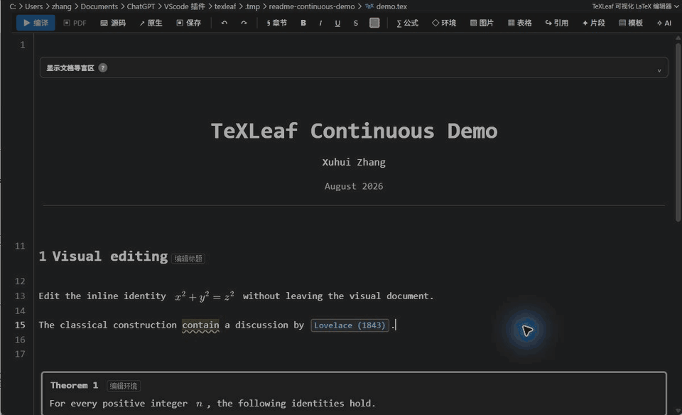
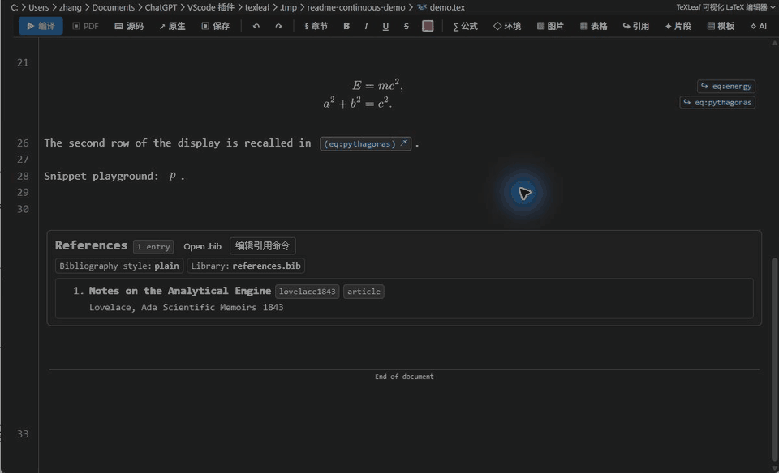
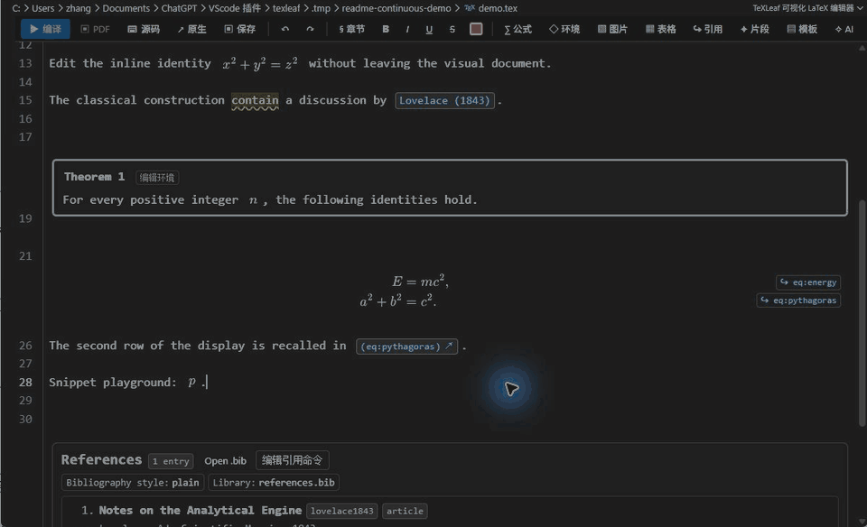
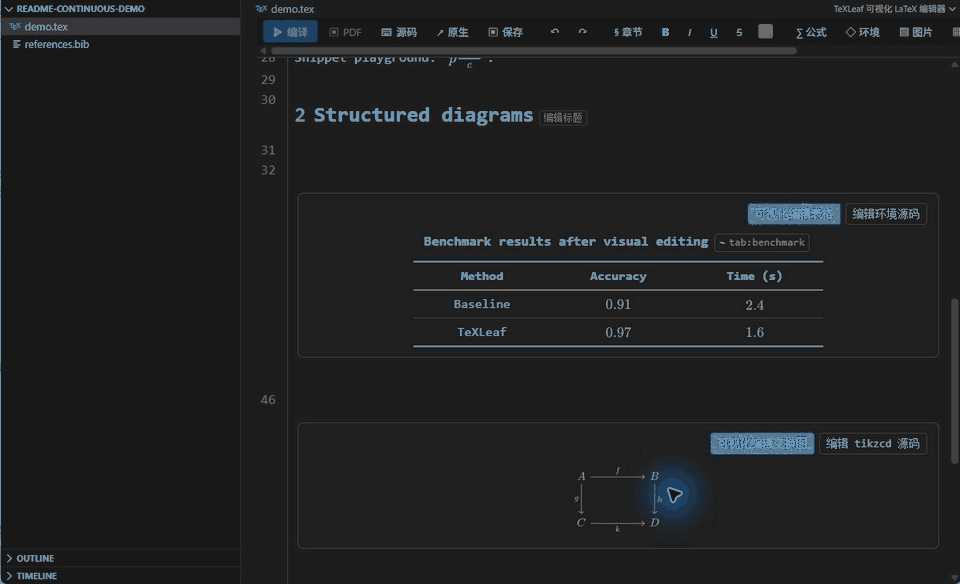
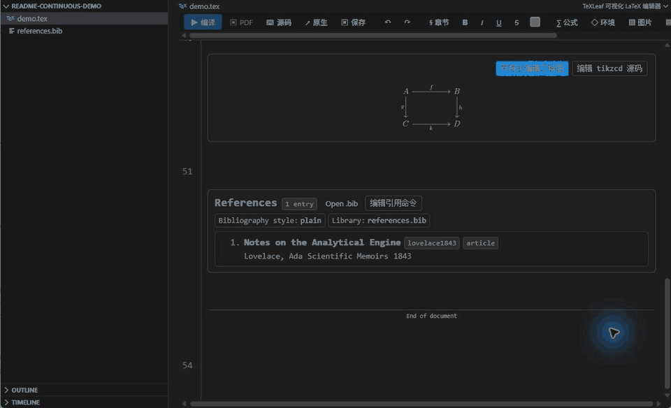
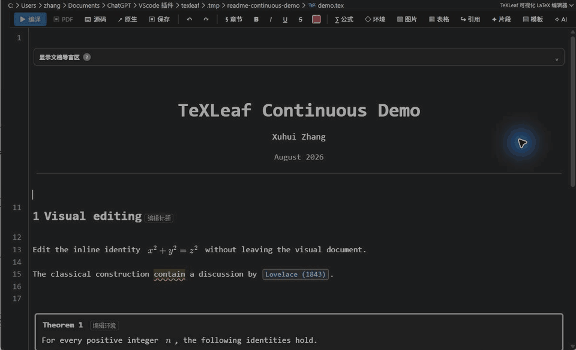
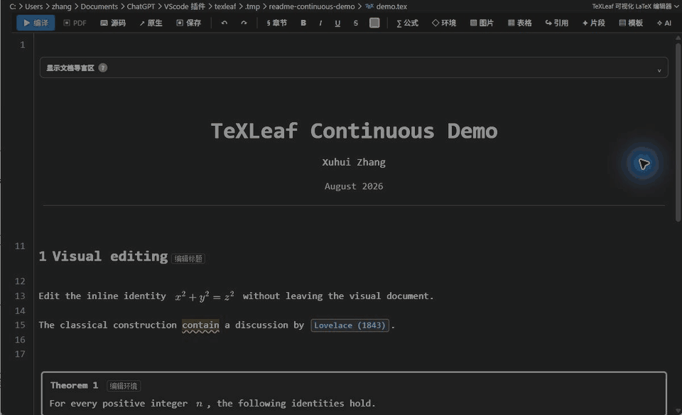
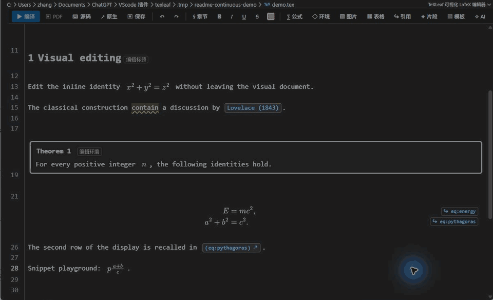

# TeXLeaf

<p align="center">
  
</p>

<p align="center">
  面向 VS Code 的可视化 LaTeX 写作扩展：原位编辑公式与文档结构，并整合高频片段、Math Preview、项目引用、Zotero 和可选 AI 写作检查。
</p>

<p align="center">
  <strong>TeXLeaf 1.1.0</strong> · VS Code 1.98+ · Windows / macOS / Linux · GPL-3.0-only
</p>

TeXLeaf 始终编辑原来的 `.tex` / `.bib` 文件，不创建中间文档，也不改变 LaTeX 源码格式。可视化模式、同标签页源码模式和 VS Code 原生编辑器共享同一份 `TextDocument`、保存状态与 Undo/Redo 历史。

TeXLeaf 不自带 TeX 编译器。编译、PDF 查看和 SyncTeX 交给 [LaTeX Workshop](https://github.com/James-Yu/LaTeX-Workshop)；TeXLeaf 专注于写作、结构化编辑、公式预览和引用工作流。

当前 **TeXLeaf 是 LaTeX Workshop 桥接版**：它复用 LaTeX Workshop 的公开命令、编译配方、PDF 查看器、SyncTeX 和编译诊断，不重复实现一套 TeX 编译基础设施。后续还将推出 **TeXLeaf-Z**——不再桥接 LaTeX Workshop、提供集成编译工作流的版本；具体功能范围和发布时间以后续公告为准，敬请期待。

## 功能总览

| 功能 | 能做什么 |
| --- | --- |
| 可视化 LaTeX 编辑器 | 把完整公式、标题、定理、证明、列表、表格、图片、参考文献等显示为可编辑结构；点击任意部件可原位恢复准确源码。 |
| 公式编辑与 Math Preview | 行内、行间及 `equation` / `align` / matrix 等环境由本地 MathJax 4 Worker 渲染；编辑时显示带精确光标的浮动预览，离开后自动恢复排版。 |
| 表格与交换图 | 用结构化表单编辑 table/tabular 的行列、单元格、表题、标签和样式；直接操纵 `tikzcd` 节点、箭头与标签，再安全回写原环境。 |
| 片段与模板 | 223 条可编辑 Snippet、四个整篇 article/Beamer 模板、结构化管理器、高级 JSONC、导入/导出和 Settings Sync。 |
| 数学输入辅助 | 自动分式、级联括号放大、Tabout、成对括号、空公式删除、matrix/align 键位、Visual 选区片段和嵌套 tabstop。 |
| 多文件项目与交叉引用 | 从显式 root、magic root、`subfiles` 或唯一包含关系建立保守项目上下文；跨文件补全、预览并跳转 `\ref` / `\eqref` / label。 |
| 文献与 Zotero | 搜索项目 bibliography 和 Zotero/Better BibTeX；插入 citekey，必要时把 BibTeX/BibLaTeX 条目原子写入 `reference.bib`。 |
| AI 写作助手 | 可选的 DeepSeek/OpenAI 正文检查、改写与续写；问题发布到 VS Code 原生 Problems，支持精确跳转、应用、忽略和批量应用。 |
| LaTeX Workshop 桥接 | 从可视化工具栏复用 LaTeX Workshop 的编译、PDF、SyncTeX 与诊断能力；TeXLeaf 不复制一套编译基础设施。 |

## 功能演示

以下 GIF 均录自隔离的 VS Code Extension Host 和当前构建，按真实鼠标、键盘与滚动过程连续取帧；文档、作者、邮箱及引用均为测试数据。

### 点击公式，原位编辑，再自动排版

点击公式后恢复 LaTeX 源码；输入时浮动 Math Preview 实时更新；光标离开公式范围后重新生成静态公式。



### Snippet 自动展开与 Tab 占位符

在数学区域输入 `//` 会连续展开为分式片段；随后用 Tab 在分子、分母和最终位置之间移动，离开源码范围后立即恢复排版。



### 定理结构、成对环境边界与多行公式

定理和证明以结构卡片显示；点击“编辑环境”或对应逻辑行会同时显示 `\begin` / `\end`，其中的 `align` 仍可继续原位展开。



### 表格可视化编辑

打开结构化表格编辑器后，可以修改环境、浮动位置、宽度、对齐、横线样式、caption、label、行列和单元格；“应用”会把当前模型安全序列化回原 `.tex`。演示把 Accuracy 从 `0.97` 连续修改并回写为 `0.99`。



### 交换图直接操纵编辑

`tikzcd` 可切换到直接操纵画布：选择节点或箭头后编辑标签、增删行列和箭头，并在应用时只重写交换图正文、保留环境选项。演示把节点 `B` 修改为 `$B_1$` 并回写到主预览。



### 文献引用在可视化与源码之间切换

cite 以作者—年份 chip 显示；点击后编辑准确引用命令，光标移出引用范围后 chip 和文献详情生命周期一起恢复。



### 文献详情与多行公式引用预览

悬停 citation 会显示项目文献详情；移开鼠标后卡片立即消失。悬停指向 `align` 中第二个 label 的 `\eqref` 时，预览显示完整多行公式，并只高亮被引用的那一行。



### AI 问题使用 VS Code 原生 Problems

AI 语言问题与 LaTeX Workshop 编译问题共用 VS Code 原生 Problems，但由各自扩展维护；点击 AI 条目会跳到准确行列并显示应用/忽略操作。



## 快速开始

1. 安装 VS Code `1.98+`。若需要编译与 PDF，再安装 LaTeX Workshop 和本机 TeX 发行版。
2. 从 [Visual Studio Marketplace](https://marketplace.visualstudio.com/items?itemName=zhangxh-math.texleaf) 安装，或从 [GitHub Releases](https://github.com/zhangxh-math/texleaf/releases) 下载 VSIX 后运行 **Extensions: Install from VSIX...**。
3. 打开一个已保存的 `.tex`。默认进入 TeXLeaf 可视化编辑器；工具栏“源码”在同一标签页显示完整高亮源码，“原生”打开 VS Code 原生文本编辑器。
4. 点击公式、定理、标题、引用、表格或交换图即可编辑对应源码或结构模型；按 `Ctrl+Space` 查询 TeXLeaf、LaTeX Workshop 等 Provider 返回的安全补全。
5. 从工具栏运行编译、PDF 或 SyncTeX。项目引用、Zotero 和 AI 均可按需启用，互不强制依赖。

如果希望 `.tex` 默认使用原生源码编辑器，将 `texleaf.visualEditor.defaultMode` 设为 `source`；需要时运行 **TeXLeaf: 使用可视化编辑器打开**，或使用 **Reopen Editor With...**。

## 可视化编辑器的关键交互

- 点击完整公式、citation、reference、label、标题或结构卡片，显示其真实 LaTeX 范围；光标离开后重新可视化。
- 鼠标点击被折叠环境的 `\begin{...}` / `\end{...}` 逻辑行，会显示成对环境边界；不会把环境后的下一行错误跳回 `\begin`。
- `↑` / `↓` 按 LaTeX 逻辑行移动，而不是按软换行后的屏幕行移动。到达普通逻辑行只展开该行；到达多行公式时展开整条公式。
- `Tab` 依次处理活动 Snippet tabstop、当前局部 Tabout 和 matrix/align 插列。它不会跳出块级环境；唯一例外是已经完成的行内 `$...$` / `\(...\)`。
- `Enter` 在列表中生成新的 `\item`；对刚生成的空 item 再按一次 Enter 只移除 item 标记并保留环境内的空白行。Enter 不负责跳出环境。
- `Shift+Enter` 是统一的环境跳出手势：跳到最近的安全结束位置，并保持外层缩进；Tab 和 Enter 不替代它。
- 自动分式把 `=`、`<`、`>`、`\le` / `\leq`、`\ge` / `\geq` 等关系运算符视为分子边界，不会把关系符吞入分子。
- 中文 IME composition、候选删除、全角标点和退格都经过范围保护，临时拼音不能删除公式左侧的既有 LaTeX 结构。
- 长文档公式按可视区分批渲染；快速滚动停止后最终视口优先，旧位置不会长期占住渲染队列。

可视化编辑器还支持：导言区折叠与完整源码编辑、标题/作者/日期预览、document-class-aware 章节和定理编号、文本加粗/斜体/下划线/删除线/颜色工具、表格与 `tikzcd` 结构化编辑、安全本地栅格图片预览、citation/label 补全、跨文件引用返回，以及可视化和源码模式中的主题跟随 LaTeX 高亮。

完整手册见 Wiki 的 [可视化编辑器](https://github.com/zhangxh-math/texleaf/wiki/Visual-Editor)。

## 片段与模板

首次运行会建立当前 VS Code Profile 的 223 条可编辑默认规则。常用示例：

| 输入 | 结果 |
| --- | --- |
| `lm` | `\(...\)` |
| `dm` | `\[...\]` |
| `//`（数学区域） | 带分子/分母 tabstop 的 `\frac{...}{...}` |
| `;a`（数学区域） | `\alpha` |
| `\thm` / `\lem` / `\dfn` | 定理、引理、定义环境 |
| `article-cn` / `article-en` | 中文或英文 article 整篇模板 |
| `beamer-cn` / `beamer-en` | 中文或英文 Beamer 整篇模板 |

运行 **TeXLeaf: 管理 Snippet 与模板** 可搜索、增删、复制、筛选、批量替换、撤销草稿和恢复出厂库；高级用户仍可编辑 JSONC。`Ctrl+Alt+L`（macOS 为 `Cmd+Alt+L`）打开完整片段选择器。

详细说明见 [片段与模板](https://github.com/zhangxh-math/texleaf/wiki/Snippets-and-Templates) 和 [Snippet 格式](https://github.com/zhangxh-math/texleaf/wiki/Snippet-Format)。

## 文献、引用与多文件项目

TeXLeaf 的 citation 搜索会合并当前 bibliography 与 Zotero 本地快照，并按 citekey、标题、作者、年份、DOI、ISBN 排序。接受 Zotero 候选时，TeXLeaf 先导出 BibTeX/BibLaTeX，再通过同一份版本校验的工作区编辑写入 bibliography 并插入 citekey。Zotero 连接固定使用 `127.0.0.1`；推荐 Zotero 8+ 与匹配版本的 Better BibTeX。

项目扫描只跟随工作区内可证明的字面 `\input`、`\include`、`\subfile`、`\import` 和 `\subimport`。遇到动态路径、未知条件、循环、重复执行、缺失文件或重名 label 时会 fail closed，不猜一个目标。公式引用预览可显示整条多行公式，并只高亮当前 label 所在行；引用箭头统一位于文本右侧。

详细说明见 [文献与 Zotero](https://github.com/zhangxh-math/texleaf/wiki/References-and-Zotero) 和 [可视化编辑器：项目与引用](https://github.com/zhangxh-math/texleaf/wiki/Visual-Editor#多文件项目与交叉引用)。

## AI 写作助手

AI 功能默认关闭，需要用户自己的 DeepSeek 或 OpenAI API Key；ChatGPT Plus/Pro 或 Codex 用量不能替代 API 额度。TeXLeaf 支持段落/选区检查、整篇分段检查、改写和续写，并把经过本地校验的问题发布到 VS Code 原生 Problems。编辑器内仍提供范围标记、建议卡、Quick Fix、应用/忽略和重新验证后的批量应用。

发送前会在本地遮罩注释、citation、label、URL、文件路径、代码和未知 TeX 结构；公式替换为不可编辑的等长语义占位符，因此模型知道此处有 inline/display formula，但不会收到公式内容。API Key 只存入当前扩展环境的 SecretStorage；每个规范化 Provider/Base URL 使用独立 Key 与授权记录。

完整的费用、隐私、可发送范围、offset 校验、持久化和故障说明见 [AI 写作助手](https://github.com/zhangxh-math/texleaf/wiki/AI-Writing)。

## Math Preview 与 LaTeX Workshop

原生源码编辑器和可视化编辑器共用 Math Preview：支持 `$...$`、`$$...$$`、`\(...\)`、`\[...\]` 及常见数学环境，提供 Cursor、Hover 或两者组合。`autoAbove`（默认）和 `autoBelow` 会根据可见空间翻转；固定 `above` / `below` 不自动改变方向。连续输入采用 last-known-good 更新，临时无效 TeX 不会让卡片每键闪烁。

TeXLeaf 只调用 LaTeX Workshop 的公开 build/view/synctex 命令。Problems 中的编译错误由 LaTeX Workshop 发布；TeXLeaf 不复制、不解释也不维护编译诊断队列。关闭 `texleaf.visualEditor.latexWorkshopCompatibility` 后，可随时从“原生”源码编辑器手动运行 LaTeX Workshop。

详见 [Math Preview](https://github.com/zhangxh-math/texleaf/wiki/Math-Preview) 和 [可视化编辑器：编译与 PDF](https://github.com/zhangxh-math/texleaf/wiki/Visual-Editor#编译pdf-与-synctex)。

## 设置与文档

在 VS Code Settings 搜索：

```text
@ext:zhangxh-math.texleaf
```

当前有 56 个用户设置，分为五组：片段 22 项、文献 9 项、AI 写作 14 项、可视化编辑器 4 项、预览 7 项。

- [Wiki 首页](https://github.com/zhangxh-math/texleaf/wiki)
- [可视化编辑器](https://github.com/zhangxh-math/texleaf/wiki/Visual-Editor)
- [片段与模板](https://github.com/zhangxh-math/texleaf/wiki/Snippets-and-Templates)
- [Snippet 格式](https://github.com/zhangxh-math/texleaf/wiki/Snippet-Format)
- [文献与 Zotero](https://github.com/zhangxh-math/texleaf/wiki/References-and-Zotero)
- [AI 写作助手](https://github.com/zhangxh-math/texleaf/wiki/AI-Writing)
- [Math Preview](https://github.com/zhangxh-math/texleaf/wiki/Math-Preview)
- [配置参考](https://github.com/zhangxh-math/texleaf/wiki/Configuration)
- [故障排查](https://github.com/zhangxh-math/texleaf/wiki/Troubleshooting)
- [开发与发布](https://github.com/zhangxh-math/texleaf/wiki/Development-and-Release)

## 安全与边界

- 可视化编辑器基于 VS Code 正式 `CustomTextEditorProvider` 和 CodeMirror 6，不向 Monaco 私有 DOM 注入未公开部件。
- Webview、文档编辑、补全、导航、MathJax Worker 和 AI 操作都有版本、范围、大小及过时代次校验；模型文字不能构造可执行命令。
- 可视化结构和项目上下文是安全静态近似，不执行 class/package 或任意 TeX 宏；最终编号、页码、字体、宏展开和版式以真实 TeX 编译为准。
- Webview 不是原生 Monaco `TextEditor`。复杂 Completion command、`additionalTextEdits`、Snippet transform、第三方 Hover/Code Action/Inline Suggest 和扩展专属键位需点击“原生”。
- 未信任工作区不会联网调用 AI、访问 Zotero、创建 bibliography 或加载项目额外片段文件。

## 开发与验证

```bash
pnpm install --frozen-lockfile
pnpm run verify
```

`verify` 会运行主扩展和 Webview TypeScript 检查、511 项单元测试、三个生产 bundle 构建，以及 extension/Webview/MathJax Worker 冒烟测试。可视化交互另有隔离 Extension Host 与 CDP 回归，包括 IME、环境边界、引用跳转、逻辑行导航和长文档快速滚动。

开发流程与 Release 清单见 [开发与发布](https://github.com/zhangxh-math/texleaf/wiki/Development-and-Release)。

## 支持 TeXLeaf

TeXLeaf 是独立维护的 GPL-3.0-only 开源项目。若它对你有帮助，可以通过微信支付、支付宝或 PayPal 支持我喝杯奶茶；赞助不会影响功能开放、Issue 优先级或发布决定。不方便赞助时，Star、可复现的 Issue、文档改进和推荐项目也同样有帮助。

维护者本人没有编程背景，不能独立编写或人工审查代码，主要负责提出真实 LaTeX 使用需求、决定产品取舍、测试和验收；开发实现、功能请求和 PR 审查只能在个人时间允许时借助 AI 辅助完成。一般优先处理可复现的 Bug，不能承诺新增功能、合并 PR、处理时限、定制开发或私人技术支持。项目以个人身份维护和收款，无法开具发票或提供报销、税务抵扣凭证。

[查看赞助方式与隐私说明](SPONSOR.md)

## 致谢与许可

TeXLeaf 由项目发起人 **zhangxh-math** 与 **OpenAI Codex** 联合开发。片段、预览、可视化编辑和引用体验受到 [Gilles Castel 的 latex-snippets](https://github.com/gillescastel/latex-snippets)、[Obsidian Latex Suite](https://github.com/artisticat1/obsidian-latex-suite)、[Snippetleaf](https://github.com/superle3/snippet-leaf)、[Ultra Math Preview](https://github.com/yfzhao20/vscode-ultra-math-preview)、[Overleaf](https://github.com/overleaf/overleaf)、[CodeMirror 6](https://codemirror.net/)、[LaTeX Workshop](https://github.com/James-Yu/LaTeX-Workshop) 与 [VSCode Zotero](https://github.com/jinvim/vscode-zotero) 等项目启发；这不表示上游项目对 TeXLeaf 的官方认可或功能等价。

TeXLeaf 项目主体采用 [GNU General Public License v3.0 only](LICENSE)。根据 GPLv3 第 7(b) 节允许的合理署名要求，再分发源码、VSIX 或修改版时必须保留 [NOTICE](NOTICE)，并在随附文档或可访问的 About/Credits/Legal Notices 中注明该软件包含或基于 TeXLeaf、原作者为 zhangxh-math，并保留原项目链接。`NOTICE` 同时提供用户文档输出例外：使用 TeXLeaf 的模板、Snippet、编辑、预览或编译功能不会让论文、幻灯片、bibliography 等用户文档自动受 GPL 或署名要求约束。历史上已经按 MIT License 获得的版本继续适用其随附条款；实际随发行包分发的第三方组件继续保留各自许可证，详见 [THIRD_PARTY_NOTICES.md](THIRD_PARTY_NOTICES.md)。完整说明见 [许可证、署名与再分发](https://github.com/zhangxh-math/texleaf/wiki/License-and-Attribution) 与 [致谢与联合开发](https://github.com/zhangxh-math/texleaf/wiki/Acknowledgements-and-Development)。

报告问题前请阅读 [SUPPORT.md](SUPPORT.md) 和 [故障排查](https://github.com/zhangxh-math/texleaf/wiki/Troubleshooting)；准备提交代码或文档时请先阅读 [CONTRIBUTING.md](CONTRIBUTING.md)。
