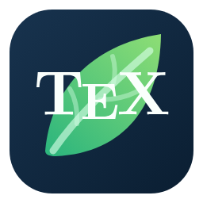

# TeXLeaf



TeXLeaf 是一个面向 VS Code 桌面版的 LaTeX 写作扩展，把高频片段、可选的 AI 写作检查、Zotero 引用和活动公式预览整合到同一个插件中。它不接管 LaTeX 编译，也不会把 VSIX 二进制提交到源码仓库；功能构思与交互设计受到下文所列开源项目的启发。

当前版本：`0.8.11`。支持 Windows、macOS 和 Linux 上的 VS Code `1.98+`；Zotero 联动需要 Zotero 桌面端允许本机通信，推荐安装 Better BibTeX。AI 写作功能需要用户为所选服务商自行准备 API Key，默认关闭。

安装方式：优先从 [Visual Studio Marketplace](https://marketplace.visualstudio.com/items?itemName=zhangxh-math.texleaf) 安装；也可以从 [GitHub Releases](https://github.com/zhangxh-math/texleaf/releases) 下载对应版本的 VSIX，在 VS Code 运行“Extensions: Install from VSIX...”。源码仓库只保存可审阅的源文件，VSIX 仅作为 Release 资产发布。

从旧身份 `local-lab.texleaf` 升级时，先在旧版中保存所有修改；如果改过模板，还应逐项保留模板名称、trigger、说明和正文。安装新版后，它会在旧版仍启用时暂停激活：此时先**禁用但不要卸载**旧版，再执行“Developer: Reload Window”。新版会在新主文件不存在、旧 JSONC 有效且磁盘内容没有变化时尽力逐字节复制旧 Snippet，并保留旧文件；确认新库无误、按需重建自定义模板后再卸载旧版。未修改的四个工厂模板会由新版自动创建。

## 片段

TeXLeaf 首次创建全局用户片段库时写入 212 条可编辑的 LaTeX 默认规则，并提供一键备份与恢复默认；运行时不再区分隐藏的内置片段和用户片段。规则支持文本、行内数学、行间数学、词边界、自动展开、正则触发、Visual 选区和 v2 占位符。常用例子包括：

- `lm` → `\(...\)`，`dm` → `\[...\]`；
- `\thm`、`\lem`、`\dfn`、`\cor` 等 13 个定理类环境自动展开；
- 分式、上下标、括号放大、矩阵、希腊字母、物理与量子力学片段；
- 矩阵和 align 环境中的 Tab 插列、Enter 换行、Shift+Enter 跳出；
- `\label{...}`、`\tag{...}` 和 `\tag*{...}` 内自动抑制数学片段，避免标签文本被意外展开；
- 可换行数学环境中对安全的 `\left...\right...` 结构执行智能跨行 Enter。

运行 `TeXLeaf: 管理 Snippet 与模板` 可打开结构化管理器。Snippet 页提供搜索、分类/状态筛选、添加、复制、删除、启用/禁用，以及 trigger、replacement、options、说明、分类、优先级、正则 flags 和占位符版本编辑；查找替换支持字段范围、大小写、正则、变更预览和草稿撤销。高级用户仍可显式打开 JSONC，但日常使用无需接触外部配置文件。

四个长模板保存在当前 VS Code Profile 的插件内部模板库中，不作为运行时外部文件：

| Trigger | 模板 |
| --- | --- |
| `tmpa-cn` | 中文 article |
| `tmpa-en` | 英文 article |
| `beamer-cn` | 中文 Beamer |
| `beamer-en` | 英文 Beamer |

在已保存且内容为空白的 `.tex` 文档中输入完整 trigger 即可自动展开。模板页可以修改名称、trigger、说明和完整 TeX 正文，也可以添加、复制、删除和恢复模板；保存后立即生效。出厂 article 模板使用 `reference.bib`，默认 BibTeX 样式为 `alpha`，并已移除姓名、邮箱、学校和导师等个人信息。

片段设置集中在 VS Code Settings 的 `TeXLeaf · 片段`，包括总开关、自动片段、补全、项目片段文件、数学快捷键和高级匹配参数。详细格式、迁移与安全边界见 Wiki 的 [片段与模板](https://github.com/zhangxh-math/texleaf/wiki/Snippets-and-Templates) 和 [Snippet 格式](https://github.com/zhangxh-math/texleaf/wiki/Snippet-Format)。

0.8.10 收紧了原生 Suggest：TeXLeaf 只返回与光标前输入具有**非空 trigger 前缀匹配**的片段；继续输入后已经不再匹配的候选会从列表移除，不会在公式末尾留下 `+-` 等无关片段。需要不依赖当前前缀浏览当前上下文可直接插入的普通片段时，使用 `Ctrl+Alt+L`（macOS 为 `Cmd+Alt+L`）。默认开启 Tabout 时，Suggest 已打开且当前位置确实有可越过的右括号、`\rangle` 或数学结束分隔符，`Tab` 优先执行 Tabout；若没有真实跳出目标，则仍接受 VS Code 当前选中的原生补全。数学区域的活动 Snippet Session 仍有下一 tabstop 时会先关闭 Suggest、再前往该占位符；Suggest/Tabout 路径不会抢占精确 TeXLeaf trigger、Inline Suggest、Rename 输入框或 Matrix action 的既有 Tab 优先级。

0.8.11 修复了普通片段没有显式 tabstop、但展开时同时触发自动放大括号的光标位置。例如在 `(sum)` 中输入完成后会得到 `\left(\sum|\right)`，光标保留在生成的 `\right` 前，可以继续输入 `+`、上下限或被求和项；当当前位置没有精确手动片段 trigger 时，按一次 `Tab` 可跳到右定界符之后。刚停在 `\sum` 后直接按 `Tab` 时，既有 `sum`-limits 手动片段仍优先展开，这是有意的既有优先级。片段本身已经声明 tabstop 时仍按它原有的占位符顺序导航。

## AI 写作助手

TeXLeaf 0.8.11 提供一套可选的 Grammarly 风格写作工作流，可选择 DeepSeek 官方/自定义的 Chat Completions API，或 OpenAI 官方/自定义的 Responses API：

- 停止键入后局部检查本次改动的正文句子，不清空其他仍有效的问题；
- 通过编辑器装饰线、TeXLeaf 专用 Hover、灯泡 Quick Fix 和活动栏问题树展示原因；Hover 中的“应用这条建议”、灯泡或问题树都可一键替换，也可在本次会话忽略；AI 问题不会重复发布到 Problems；
- 在 TeXLeaf 活动栏的“AI 写作问题”列表集中审阅建议与检查状态；点击条目会用主题自适应背景和轮廓突出对应正文，其他问题继续保留下划线；
- 手动检查当前选区/段落或整篇 `.tex` 文档；
- 对纯正文选区或当前句执行安全改写；
- 提供可单独关闭的词语和句子行内补全，也可从 Command Palette 手动触发；
- 总开关 `texleaf.aiWriting.enabled` 默认是 `false`，关闭时不会向任何 AI 服务发出请求。

默认服务商是 DeepSeek，默认模型为低延迟的 `deepseek-v4-flash`，也可选 `deepseek-v4-pro`。DeepSeek 默认 Base URL 为 `https://api.deepseek.com`，请求规范化后的 `POST {Base URL}/chat/completions`。切换到 OpenAI 时默认模型是适合高频、成本敏感工作负载的 [`gpt-5.6-luna`](https://developers.openai.com/api/docs/models/gpt-5.6-luna)，也可以填写其他安全模型 ID；OpenAI 默认 Base URL 为 `https://api.openai.com/v1`，只请求 `POST {Base URL}/responses`、Structured Outputs 和本插件使用的 JSON Schema，不回退到 Chat Completions。两种自定义地址都要求远程 HTTPS；HTTP 只允许 `localhost`、`127.0.0.1` 或 `[::1]` 回环服务；URL 不能带用户名、密码、查询参数或 fragment，路径也不能已经以该 Provider 的 `/chat/completions` 或 `/responses` endpoint 结尾；请求不会跟随 HTTP 重定向。协议说明见 DeepSeek 的 [Create Chat Completion](https://api-docs.deepseek.com/api/create-chat-completion) 和 [JSON Output](https://api-docs.deepseek.com/guides/json_mode/)，以及 OpenAI 的 [Responses 指南](https://developers.openai.com/api/docs/guides/migrate-to-responses) 与 [Structured Outputs 指南](https://developers.openai.com/api/docs/guides/structured-outputs)。

全部 14 个 `texleaf.aiWriting.*` 设置都是 VS Code 的 application 级用户/Profile 设置，可以随普通 Settings Sync 同步；工作区、工作区文件夹和 `.vscode/settings.json` 不能开启 AI、重定向接收地址、切换 Provider/模型，或改变防抖与发送长度等费用相关参数。API Key 和每个目标的正文传输确认不属于普通设置，仍需在实际运行扩展的每台设备、Profile、Stable/Insiders 或 Remote 扩展宿主中分别完成。

0.8.6 修复了 `language-too-long` 本地配置错误：此前控制器把“按正文语言写作、但用简体中文解释建议”等完整提示误当作 `language` 协议标签，超过客户端的 64 字符安全上限，因此 DeepSeek 与 OpenAI 的自动检查、手动段落/选区检查、整篇检查、改写和行内补全都会在发出 HTTP 请求前被拦截。现在三个用户选项统一映射为短标签 `auto`、`English`、`Chinese`；中文 `message`/`explanation` 与保持正文原语言的要求仍由受控 system prompt 提供，没有被取消。客户端仍会在联网前拒绝真正超长或含换行/控制字符的直接输入。

0.8.7 修复了“建议已经应用、问题却仍留在界面中”的状态不同步：单条 Quick Fix 和“应用全部”写入成功后会立即消费对应问题，并同步更新装饰线、Hover、活动栏列表与本机缓存。增量保留现在把问题右端点处的词尾插入视为相关编辑；如果当前正文已经由候选的 `original` 加紧邻字符组成完整 `replacement`，例如正文已有 `takes`、候选却只锚定 `take` 并仍建议 `takes`，该截短范围会在在线校验和缓存恢复时被拒绝，避免旧建议重新出现。

0.8.8 修复了连续从问题树或灯泡应用建议时的旧命令竞态：一次修改如果只让后续有效问题整体平移，这些问题会保留稳定的 lineage ID，已经显示的树节点或 Quick Fix 仍能在重新核对当前范围与 `original` 后安全应用，不会因为绝对 offset 改变就误报“文档已变化”。真正已经失效的旧节点会触发问题列表刷新，并只在状态栏显示一条短提示，不再弹出通知或播放音效。“应用全部”在确认后也会按稳定 ID 重新解析当前安全问题；等价的内部状态刷新不会让整批操作误失败，确认前捕获的任一建议已移除、失效或无法唯一解析，或者正文已经变化时仍会整批停止。确认后新出现、未被确认的其他建议不会被纳入这一批修改。

0.8.9 处理了微软拼音中文模式与 VS Code Quick Fix 的快捷键冲突：微软拼音会优先使用 `Ctrl+.` 切换中英文标点，因此按键可能根本不会送达 VS Code。可以先按 `Shift` 切到英文输入模式后再按 `Ctrl+.`，也可以通过 `F1` / Command Palette 或右键运行“快速修复...”、点击灯泡。TeXLeaf 专用 Hover 现在还提供“应用这条建议”链接；它只调用白名单中的 TeXLeaf 内部命令，模型返回的说明和替换文本仍不可执行，后端仍会在实际写入前重新核对文档版本、问题身份、当前范围、exact `original` 与可编辑正文，过期建议不会修改文件。

首次使用请运行 `TeXLeaf: 切换 AI 写作助手`；流程会针对当前服务商和实际目标地址说明正文传输与独立计费，也可事先运行 `TeXLeaf: 设置当前 AI 服务商 API Key`。Key 只写入当前 VS Code 扩展环境的 `SecretStorage`，不会进入 `settings.json`、项目、日志、Git、TeXLeaf 的 Snippet Settings Sync 或普通 VS Code 设置同步。每一个规范化 DeepSeek 或 OpenAI Base URL 都分别保存 Key 和 consent；DeepSeek 官方地址继续兼容此前版本使用的 `v1` Key/consent，切换到任意自定义 DeepSeek 地址时则一定使用新的目标专用记录，绝不会复用官方 Key。OpenAI 官方地址与各个自定义地址同样互相隔离，两种 Provider 之间也不会交叉复用。Key 和 consent 不跨设备、Profile、Stable/Insiders 或本地/Remote 扩展宿主同步，需要逐环境设置。

ChatGPT Plus/Pro、Codex 使用额度和 OpenAI API 是彼此独立的产品与计费体系；ChatGPT 订阅不能替插件提供 OpenAI API 授权，也不能支付 DeepSeek 或第三方代理费用。OpenAI 请求会明确携带 `store:false`，但对自定义代理，这只是 TeXLeaf 发出的请求参数，代理是否保留、处理或用于训练仍由该服务商的政策决定。涉及未公开论文、保密审稿或敏感研究数据时，使用前应先确认自己有权把相应文字发送给所选服务。

联网检查只在当前 VS Code 窗口已受信任时，对已经有文件名和路径的本地 `file:` 或 Remote/WSL/Dev Container `vscode-remote:` `.tex` 文档生效；自动检查和补全可能发送当前编辑器中**尚未写入磁盘**的最新正文。`.bib`、untitled、Git/其他虚拟 URI 和未信任窗口不会发送内容。发送前，TeXLeaf 会在本地遮罩注释、引用/标签/URL、文件路径、未知宏参数以及代码和未知环境；只保留普通正文以及明确允许的 `section`、`caption`、`emph` 等正文参数供检查。数学公式会替换成受保护、不可编辑、与源码 UTF-16 等长的语义占位符：模型只知道此处有一个 inline/display formula，不会收到公式内容，也不能把占位符纳入修改范围。这样既维持 offset 一一映射，也能避免把 `Take` 后的行间公式误判为缺少宾语。这个低延迟扫描器不是完整 TeX 编译器，复杂自定义宏附近应优先使用小选区并在应用建议前复核。

模型虽然被要求返回零基 UTF-16 offset，但有些模型或兼容接口会改按 Unicode code point、UTF-8 byte，或把 CRLF 当成一个换行计数。TeXLeaf 只在本地尝试有限的坐标解释，并要求非空 `original` 逐字对应到一个**无歧义**的源码范围；如果上报坐标都不吻合，也只会重定位到全文唯一的逐字匹配。它不会做 Unicode、大小写、引号或空白归一化，也不会用模糊相似度猜测重复文本的位置。Review 合约要求简短的 `message` 与 `explanation` 使用简体中文，`replacement` 则保持来源正文的原语言，不会为了中文解释而翻译论文。纯插入必须写成带相邻原文的非空锚点，并在 replacement 中保留该锚点，而不是返回无法定位的零长度范围；本地会严格验证非空锚点和 replacement 安全字符，但不会把每个普通替换都误判为“必须包含 original”。每条建议还要通过正文可编辑区、重叠和 LaTeX 控制字符校验：单条坏建议只会被丢弃，互不依赖且不重叠的有效建议仍可显示；相互重叠的冲突组会全部丢弃，完全相同的重复项则只保留一条，原文不会被自动修改。

活动栏的“AI 写作问题”视图会按行号列出类别、真实严重性、`原文 → 替换` 和解释。点击建议会滚动到对应范围，并给该问题叠加主题自适应的背景与轮廓；其他问题继续保留下划线。定位和高亮不移动编辑器主光标、不夺走列表焦点，也不发布原生 Diagnostic 或触发对应音效。选中的问题通过稳定 issue lineage 跟随无关前文编辑造成的安全平移；它被应用、忽略、清除、判定失效或关闭 AI 后，高亮会自动消失。单条建议可以从专用 Hover 的“应用这条建议”、灯泡 Quick Fix 或问题树应用，也可以忽略；视图工具栏与 Command Palette 还提供“显示 AI 写作问题列表”和“应用当前全部 AI 建议”。所有单条入口最终都进入同一套后端复核，不因链接位于 Hover 就跳过版本、身份、范围、原文或正文作用域检查。安全平移的问题保留稳定的操作身份；真正失效的旧节点只会刷新列表并显示短状态栏提示。“应用全部”会先要求确认，再按捕获的稳定 ID 解析当前安全问题，并对文档版本、范围、原文和相互重叠重新做整批校验；等价状态刷新不会误判失败，确认前捕获的任一建议已经过期时仍不会冒险修改。确认后才出现的其他建议不属于这一批。视图还会明确显示检查中、已调度、多少个改动句子等待局部复检、当前仍保留的问题数，以及被安全丢弃建议的汇总。

TeXLeaf 不包含或播放检查音频，也不再把 AI 问题发布为 VS Code 原生 Diagnostic。编辑器中的无音频装饰线只负责标出范围；类别、解释、替换预览与真实严重性由 TeXLeaf 专用 Hover 和活动栏问题树提供，Hover 的白名单“应用这条建议”链接与灯泡 Quick Fix 都会在应用前重新校验。这样不会产生重复的原生诊断 Hover，AI 问题也不会出现在 Problems 或触发 Error/Warning accessibility signal。

例如检查结果提示“42 条可审阅，另安全忽略 20 条”，表示模型候选中有 42 条完成了精确、无歧义的本地映射；另外 20 条因完全重复、范围重叠、无法唯一定位或字段不安全而按 fail-closed 原则丢弃。这不是 API Key、余额或认证错误，被忽略的候选不会修改原文。

自动检查的默认防抖时间为 900 毫秒（可在 500–10000 毫秒范围内调整）。继续键入会取消旧请求并重新计时；本次编辑涉及的句子会进入局部复检队列，而纯光标导航只有在没有改动句子待处理时才选择光标附近句子。中文 `。！？` 即使句间没有空格也会正确分句，句末中英文引号与括号会保留在前句。自动调度每批最多处理 8 个改动句子；同一文档版本、同一句子和相同 AI 配置不会重复请求，每版本最多自动请求 64 个不同句子，达到上限后不会逐出去重记录再产生重复费用。

一次可精确重建的文本事务会计算**旧句子与新句子并集**作为完整复检上下文，但不会因此让整句旧问题全部失效。真正的失效范围只覆盖实际编辑以及累计尚未复检的精确 UTF-16 区域：与它不相交的同句建议，在 `original` 与新正文逐字一致、仍位于可编辑正文且能严格平移时继续保留；自动复检返回后，也只替换命中局部范围或与新建议相交的旧项。插入/删除句号或空行造成的 split/merge、同一事务多处编辑和零宽边界都纳入这一模型；在问题右端点插入词尾会使该旧问题失效，而不会误清同句其他无关建议。保存或其他没有正文变化的空 change 不会清除结果。每个句子成功返回后立即合并并从 pending 队列移除；同批后续 API 请求失败不会回滚已经成功的前句，剩余句子会继续显示为“等待局部复检”。无法无歧义重建的异常事务才会 fail closed 丢弃不再可靠的结果。它仍不是“每按一个键就联网”：防抖、取消和去重会合并连续操作，而真实网络延迟、服务商限额与费用意味着体验只能是近实时。

已通过校验的问题列表会写入当前 VS Code Profile/扩展宿主的私有 `globalStorage`，因此在通常的单扩展宿主使用中，关闭文档或重启 VS Code 后仍可恢复；它不写工作区、不进入 Settings Sync，也不保存论文全文。缓存只保存文档 URI、全文长度与 SHA-256、必要的单条问题字段及其短原文锚点。只有当前完整源码的 UTF-16 长度与 SHA-256 都和快照完全一致时，才按已验证 offset 逐条恢复；文件被外部修改、hash/长度不匹配，或单条范围、原文、可编辑区及截短 replacement 校验失败时会安全丢弃并要求重检，不跨源搜索相同短语。单文档最多 2048 条、单记录最多 2 MiB；每个 Profile 最多 256 个文档记录、总量最多 32 MiB。写入采用 750 毫秒防抖和同目录临时文件后 rename，是 Profile-local 的 best-effort 快照，不宣称提供多个同时运行窗口之间的事务或强 CAS 保证。pending、正在请求和“本次会话忽略”仍只属于当前扩展宿主会话。

DeepSeek JSON 输出为空或不是合法 JSON 时，TeXLeaf 只会自动重试一次；认证、余额、限流、超时、取消、字段/范围错误和其他结构错误不会重试。兼容模型偶尔返回的恰好一层完整 ```` ```json … ``` ```` 围栏可以被安全剥离，但围栏外有额外文字、嵌套围栏或本地校验失败时仍会拒绝。错误只保留认证、计费、限流、超时、响应无效等安全分类和内部子码，不记录 API Key、论文正文或原始服务端响应。

服务商、模型、两个独立 Base URL、自动检查、行内补全、语言、风格、防抖和本次发送长度上限等 14 项 application 级设置集中在 `TeXLeaf · AI 写作`。完整设置、隐私、费用、命令和故障说明见 [docs/configuration.md](docs/configuration.md) 与 Wiki 的 [AI 写作助手](https://github.com/zhangxh-math/texleaf/wiki/AI-Writing)。

显式检查多段选区或当前 TeX 文档还设有单次最多 32 个正文段的请求上限；每个正文段成功后立即进入列表，后续段失败不会撤销此前结果。达到段数或字符数上限后会停止并提示，其余正文不会发送。这样即使选区或文档由大量极短正文段组成，也不会在一次命令中生成无界数量的付费请求。

## 文献

当光标位于 `\cite{...}`（以及配置的其他引用命令）参数中时，TeXLeaf 使用 VS Code 原生 Suggest 展示参考文献：

- 第一组来自项目 `reference.bib` 中已有的条目；
- 第二组来自 Zotero/Better BibTeX 中尚未写入该 `.bib` 的条目；
- 输入题目、作者、年份或 citation key 的任意部分均可筛选；
- 支持一个 `\cite{...}` 中连续加入多个、逗号分隔的 key；
- 接受已有条目时只插入 key；接受 Zotero 条目时先导出 BibTeX/BibLaTeX，再以同一个 `WorkspaceEdit` 写入 bibliography 并插入 key；
- bibliography 文件名和导出格式均可配置，默认分别是 `reference.bib` 和 BibTeX。

TeXLeaf 自己的 Suggest 条目在左侧只显示标题和来源，避免 citation key 挤占宽度；右侧详情按字段显示完整标题、作者、期刊/出版物、年份、`Citation key`、来源与导入状态。LaTeX/TeX 文档默认关闭 VS Code 的普通文档单词建议。VS Code 不允许一个 Completion Provider 删除另一个扩展的候选，因此 LaTeX Workshop 若同时提供 citation completion，仍由它自己的设置控制。

Zotero 连接固定使用 `127.0.0.1`，不会访问远程 Zotero 账户。优先调用 Better BibTeX JSON-RPC 获取稳定 citekey 和 BibTeX/BibLaTeX；不可用时回退 Zotero 官方 Local API。请在 Zotero 中启用“允许本机其他应用与 Zotero 通信”。Zotero 8+ 与当前 Better BibTeX 是推荐组合；使用旧版 Zotero 时请同时核对对应 BBT 版本。

文献设置集中在 `TeXLeaf · 文献`，涵盖功能开关、自动弹出、bibliography 路径、引用命令、Zotero 端口/文库、超时/缓存和 BibTeX/BibLaTeX 格式。完整流程与故障排查见 Wiki 的 [文献与 Zotero](https://github.com/zhangxh-math/texleaf/wiki/References-and-Zotero)。

## 预览

Math Preview 的产品方向受到 Ultra Math Preview 与 hscopes-booster 启发。TeXLeaf 当前使用随扩展提供的 MathJax 4 和 New Computer Modern SVG 字体渲染活动公式，并按文档版本、公式、主题、缩放和宏配置缓存结果，以控制扩展宿主开销。

- 支持 `$...$`、`$$...$$`、`\(...\)`、`\[...\]` 及 equation、align、matrix 等数学环境；
- 跳过注释、verb/verbatim 和不安全的未闭结构；
- 行内公式预览默认位于活动源码行下方，并随光标所在行移动；
- 行间公式预览对齐 opening delimiter；超宽公式保持该对齐，右端可能由编辑器裁切；
- 卡片使用不透明、圆角、主题自适应背景，预览内有独立高亮光标；
- 深色主题使用高对比纯白矢量字形和高精度 SVG 渲染提示；
- 支持 Cursor、Hover 或两者组合，并提供防抖、长度、缩放、缓存和受限宏配置。

在 `cursor` 和 `both` 模式中，连续输入采用 last-known-good / stale-while-revalidate：防抖和后台渲染期间保留上一张有效预览，再用同一个稳定 decoration 原位换成新帧；临时无效 TeX 或中间渲染失败有 750 ms 宽限，Hover SVG 仅在实际请求 Hover 时写盘。因此持续输入不会再每键先把 cursor 卡片清空。离开公式、关闭总开关、运行“关闭当前 Math Preview”，或停在无效状态超过宽限后仍会清理旧卡片。`hover` 使用 VS Code 原生 Hover，编辑器在输入时仍可能主动关闭它；无闪烁保证针对 cursor decoration，不代表改变了原生 Hover 生命周期。

VS Code 稳定扩展 API 不提供可安全替换编辑器源码行、又能点击在渲染结果与 TeX 之间切换的公开 view-zone/DOM 能力。TeXLeaf 因此专注于保持源码编辑器可预测的活动公式轻量预览，不提供整篇所见即所得替换或内置 PDF 面板。

预览设置集中在 `TeXLeaf · 预览`。渲染方式、定位边界、主题和性能说明见 Wiki 的 [Math Preview](https://github.com/zhangxh-math/texleaf/wiki/Math-Preview)；全部设置的索引见 [配置参考](https://github.com/zhangxh-math/texleaf/wiki/Configuration)。

## 致谢与联合开发

TeXLeaf 由项目发起人 **zhangxh-math** 与 **OpenAI Codex** 联合开发。zhangxh-math 在开始本项目时并不懂如何编写 VS Code 插件，主要负责提出真实的 LaTeX 写作需求、选择功能方向、决定优先级、持续安装测试并反馈验收；Codex 协助完成资料研究、架构设计、代码实现、自动化测试、文档编写与问题定位。最终产品取舍、发布决定和仓库维护仍由项目维护者负责。

片段系统与高速 LaTeX 输入体验感谢以下项目带来的灵感：

- [latex-snippets](https://github.com/gillescastel/latex-snippets)：Gilles Castel 基于 Vim、UltiSnips 与 VimTeX 展示的高效 LaTeX 输入工作流；
- [Obsidian Latex Suite](https://github.com/artisticat1/obsidian-latex-suite)：可编辑片段格式、上下文触发、自动分式、矩阵、Visual 与 Tabout 等交互；
- [Snippetleaf](https://github.com/superle3/snippet-leaf)：把片段体验适配到另一种编辑器宿主的实践，以及格式与占位符兼容思路；
- [VSCode-LaTeX-Inkscape](https://github.com/sleepymalc/VSCode-LaTeX-Inkscape)：把高速 LaTeX/片段工作流带入 VS Code 的实践。

Math Preview 感谢：

- [Ultra Math Preview for VS Code](https://github.com/yfzhao20/vscode-ultra-math-preview)：实时公式预览的产品构思与使用体验；
- [hscopes-booster（HyperScopes Booster）](https://github.com/yfzhao20/hscopes-booster)：面向 VS Code 扩展的 token 与 TextMate scope 查询思路。

Zotero 与参考文献工作流感谢：

- [Overleaf](https://github.com/overleaf/overleaf)：开源协作式 LaTeX 项目编辑体验；
- [VSCode Zotero](https://github.com/jinvim/vscode-zotero)：从本地 Zotero 选择文献并把 Bib(La)TeX 条目写入项目 bibliography 的工作流。

这里的“感谢、启发与参考”描述的是对公开产品设计、交互和工作流的学习，不表示这些上游项目对 TeXLeaf 的官方认可、隶属关系或功能等价。更完整的逐项说明、联合开发过程与来源边界见 Wiki 的 [致谢与联合开发](https://github.com/zhangxh-math/texleaf/wiki/Acknowledgements-and-Development)；实际随发行包分发的第三方组件及许可证以 [THIRD_PARTY_NOTICES.md](THIRD_PARTY_NOTICES.md) 为准。

---

开发、测试和 Release 流程见 [开发与发布](https://github.com/zhangxh-math/texleaf/wiki/Development-and-Release)；使用问题见 [支持说明](SUPPORT.md) 与 [故障排查](https://github.com/zhangxh-math/texleaf/wiki/Troubleshooting)。项目采用 [MIT License](LICENSE)，MathJax 等第三方组件的许可见 [THIRD_PARTY_NOTICES.md](THIRD_PARTY_NOTICES.md)。
